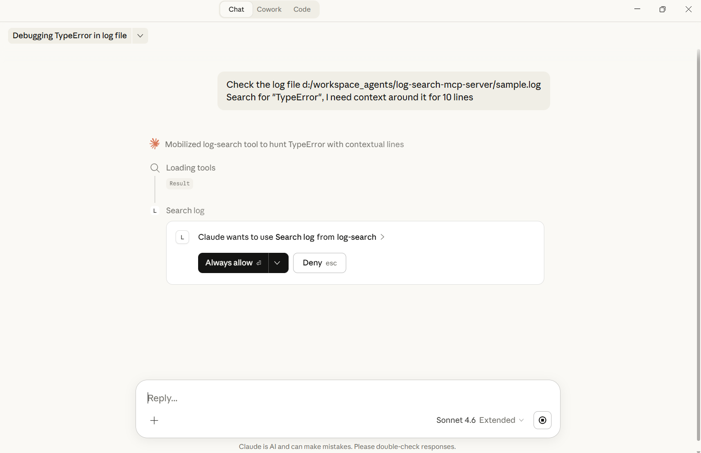
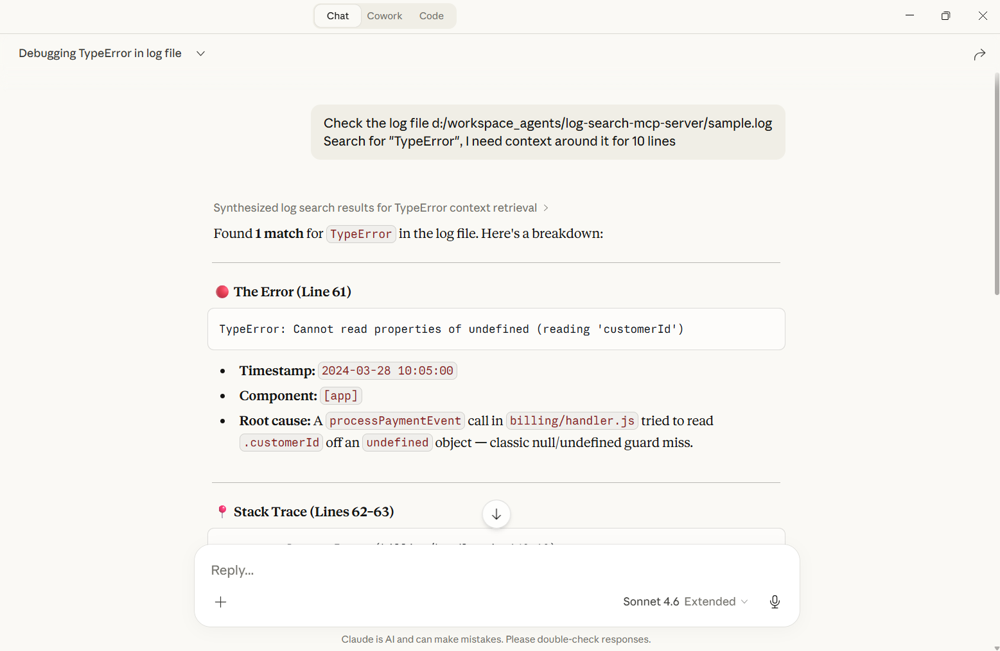
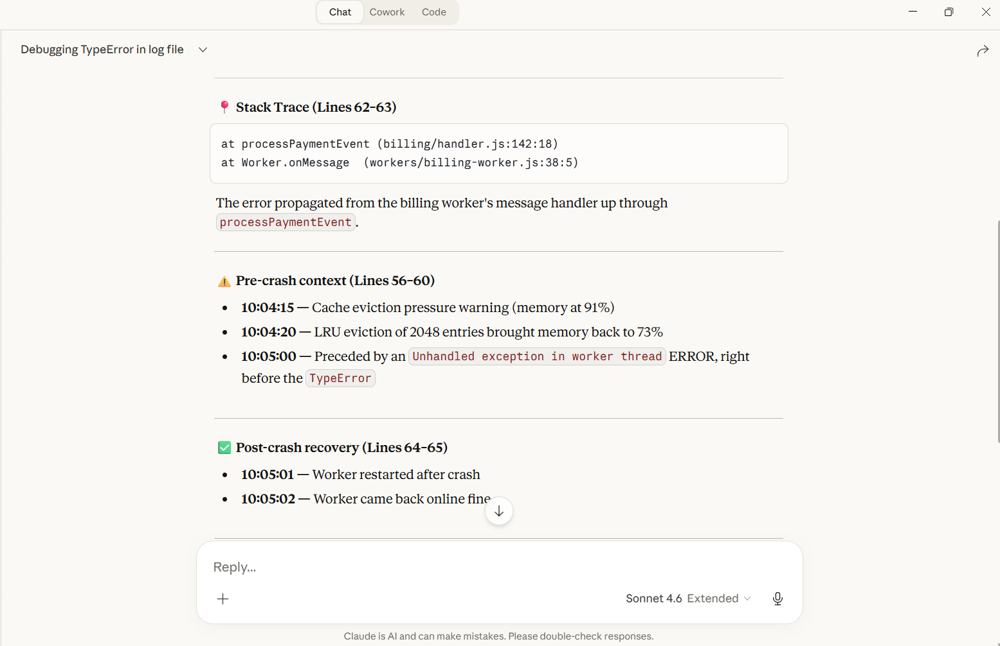
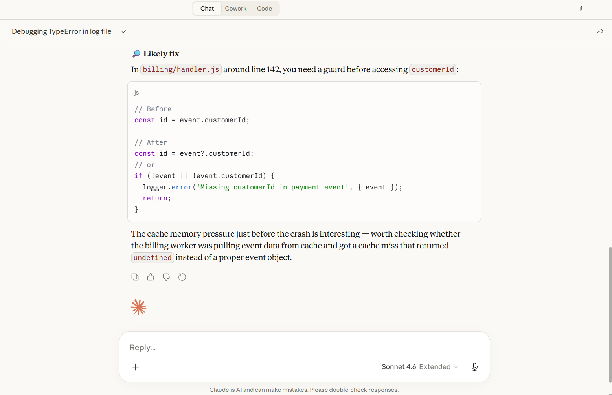
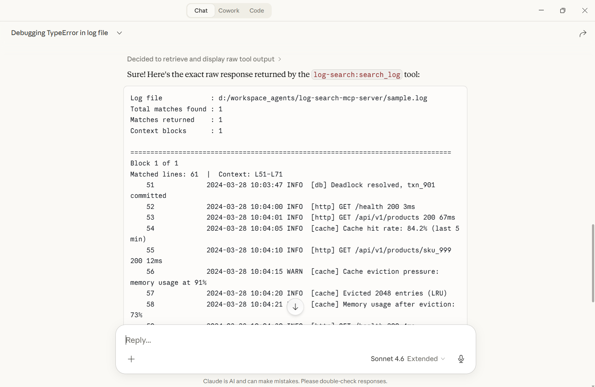
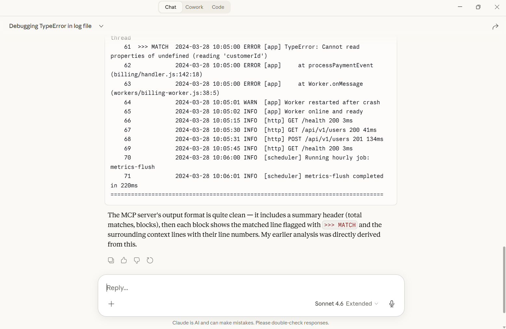

# log-search-mcp-server

An MCP server for Claude Desktop(or other tools) that searches log files for keywords and returns matching lines with surrounding context.

## Features

- Keyword matching with OR logic across multiple include terms (case-insensitive)
- Exclude filter to suppress noisy lines
- Configurable context window around each match
- Automatic merging of overlapping context blocks — no duplicate lines
- Match limit cap with a warning when results are truncated
- Streams large files with `readline` — does not load the entire file into memory

## Demo

The example below uses the included `sample.log` file and the prompt:

> Check the log file d:/workspace_agents/log-search-mcp-server/sample.log
> Search for "TypeError", I need context around it for 10 lines

**Claude requests permission to use the tool:**



**Claude analyses the match and breaks down the error:**



**Stack trace and surrounding context (pre-crash and post-recovery):**



**Claude suggests a fix based on the log evidence:**



**Raw tool output — the formatted log block returned by the server:**





---

## Project Structure

```
log-search-mcp-server/
├── src/
│   ├── index.ts          # MCP server entry point, tool registration
│   ├── types.ts          # Shared TypeScript interfaces
│   ├── log-searcher.ts   # Core search logic (readline streaming)
│   └── formatter.ts      # Plain-text output formatting
├── package.json
└── tsconfig.json
```

## Tool: `search_log`

| Parameter | Type | Required | Default | Description |
|---|---|---|---|---|
| `log_file_path` | `string` | Yes | — | Absolute path to the log file |
| `include_keywords` | `string[]` | Yes | — | Match lines containing ANY keyword (case-insensitive) |
| `exclude_keywords` | `string[]` | No | `[]` | Skip lines containing ANY keyword (case-insensitive) |
| `context_lines` | `number` | No | `25` | Lines before and after each match |
| `match_limit` | `number` | No | `20` | Max matched lines to return |

### Output format

```
Log file            : /var/log/app.log
Total matches found : 47
Matches returned    : 20 (limit: 20)
⚠️  Results capped at 20. Refine your keywords or increase match_limit to see more.
Context blocks      : 12

================================================================================
Block 1 of 12
Matched lines: 142, 145  |  Context: L117–L170
   117             2024-03-28 10:01:14 INFO  request received
   ...
   142  >>> MATCH  2024-03-28 10:01:39 ERROR chargebee webhook timeout
   143             2024-03-28 10:01:40 DEBUG retrying...
   145  >>> MATCH  2024-03-28 10:01:42 ERROR chargebee webhook 503
   ...
================================================================================
```

- Line numbers are 1-based, right-padded to 6 characters
- Matched lines are marked with `>>> MATCH`
- Overlapping context windows are merged into a single block

## Setup

### 1. Install dependencies

```bash
npm install
```

### 2. Build

```bash
npm run build
```

### 3. Configure Claude Desktop

Add to your `claude_desktop_config.json`:

```json
{
  "mcpServers": {
    "log-search": {
      "command": "node",
      "args": ["/absolute/path/to/log-search-mcp-server/dist/index.js"]
    }
  }
}
```

The config file is located at:
- **macOS**: `~/Library/Application Support/Claude/claude_desktop_config.json`
- **Windows**: `%APPDATA%\Claude\claude_desktop_config.json`

Restart Claude Desktop after editing the config.

## Example prompts

```
Check the log file d:/workspace_agents/log-search-mcp-server/sample.log
Search for "TypeError", I need context around it for 10 lines
```

```
Search /var/log/app.log for ERROR lines with 5 lines of context.
```

```
Search /var/log/app.log for "timeout" or "503". Exclude lines containing "health".
```

```
Search /var/log/app.log for "ERROR" with match_limit 50. How many total matches are there?
```

## Development

```bash
# Build
npm run build

# Run directly (stdio — expects JSON-RPC input)
node dist/index.js
```

### Smoke test

```bash
echo '{"jsonrpc":"2.0","id":1,"method":"tools/call","params":{"name":"search_log","arguments":{"log_file_path":"/absolute/path/to/sample.log","include_keywords":["ERROR"],"context_lines":3}}}' | node dist/index.js
```

A `sample.log` file is included in the repo root for testing.

### MCP Inspector

[MCP Inspector](https://github.com/modelcontextprotocol/inspector) is a browser-based UI for testing MCP servers without needing Claude Desktop. It lets you call tools interactively, inspect raw JSON-RPC requests and responses, and iterate quickly during development.

Run it directly against the built server — no install required:

```bash
npx @modelcontextprotocol/inspector node dist/index.js
```

Then open `http://localhost:6274` in your browser.

From the UI:
1. Select the `search_log` tool from the tool list
2. Fill in `log_file_path`, `include_keywords`, and any optional parameters
3. Click **Run** to execute and inspect the raw response

## Dependencies

| Package | Purpose |
|---|---|
| `@modelcontextprotocol/sdk` | MCP server and stdio transport |
| `zod` | Input schema validation |
